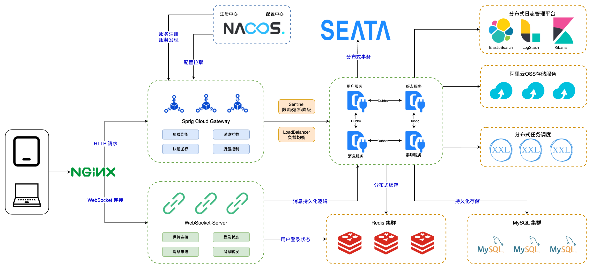

# mate-im

> 设计文档见：[设计文档](#设计文档)

## 项目简介

mate-im 是一个基于微服务架构的即时通讯(IM)系统，采用Spring Cloud、Spring Boot等主流技术栈构建。该项目致力于提供高性能、可扩展的企业级即时通讯解决方案，支持一对一聊天、群聊、消息推送等核心功能。</br>

系统采用模块化设计，通过服务拆分实现业务解耦，主要包括用户管理、好友关系、群组管理、消息转发、权限认证等核心业务模块，并集成了多种中间件和技术组件以提升系统的稳定性和性能。

## 项目架构



### 技术栈一览

- 核心框架：Spring Boot 3.x、Spring Cloud
- 注册中心：Nacos
- 配置中心：Nacos
- 服务调用：Dubbo
- 消息队列：RocketMQ 5.x
- 缓存组件：Redis 7.x
- 数据库：MySQL 8.0.x
- 数据库连接池：Druid
- 权限认证：Sa-Token
- 限流熔断：Sentinel
- 链路追踪：SkyWalking
- 监控告警：Prometheus + Grafana
- 工具类：Hutool、Guava、MapStruct、Lombok
- 构建工具：Maven

## 设计文档

### 目录

1. [文件目录结构](#文件目录结构)
2. [代码分层](#代码分层)
3. [通用设计](#通用设计)
4. [数据库表关系](#数据库表关系)
5. [各模块设计](#各模块设计)
6. [最佳实践](#最佳实践)

### 文件目录结构

```text
│  .gitignore
│  LICENSE
│  list.txt
│  pom.xml
│  README.md
├─mate-im-business ------ 业务模块
│  │  pom.xml
│  ├─mate-im-auth  ---------- 授权模块（身份认证、登录、注册接口）
│  ├─mate-im-friend  -------- 好友模块（管理一对一好友相关功能）
│  ├─mate-im-group  --------- 群组模块（管理群组相关功能）
│  ├─mate-im-logic  --------- 消息转发逻辑模块（负责消息转发核心业务）
│  ├─mate-im-notice  -------- 通知模块（发送短信验证码、邮箱验证码等）
│  └─mate-im-user  ---------- 用户模块（管理用户信息）
├─mate-im-common  ----------- 通用模块（通用设计模块，主要是项目基础设计，集成中间件）
│  │  pom.xml
│  ├─mate-im-api  ----------- 接口模块（集成各模块对外开放接口）
│  ├─mate-im-base  ---------- 基础设计模块（项目通用基础设计）
│  ├─mate-im-cache  --------- 集成缓存模块（集成 Redis 缓存）
│  ├─mate-im-datasource  ---- 集成数据源模块（集成 MySQL 数据源、Druid 连接池）
│  ├─mate-im-limiter  ------- 集成限流模块（集成 Sentinel 限流）
│  ├─mate-im-lock  ---------- 集成分布式锁模块（集成 Redisson 分布式锁）
│  ├─mate-im-mq  ------------ 集成消息队列模块（集成 RocketMQ 消息队列）
│  ├─mate-im-prometheus ----- 集成监控模块（集成 Prometheus 监控）
│  ├─mate-im-rpc  ----------- 集成RPC模块（集成 Dubbo RPC 框架）
│  ├─mate-im-sa-token ------- 集成SA-TOKEN模块（集成 SA-TOKEN 鉴权框架）
│  └─mate-im-skywalking  ---- 集成SkyWalking模块（集成 SkyWalking 链路追踪）
├─mate-im-connector  -------- WebSocket 连接模块（负责管理 WebSocket 连接，接收、推送消息）
└─mate-im-gateway  ---------- 网关模块（HTTP 请求入口，负责请求转发、限流、认证鉴权）
```

### 代码分层

```text
│
├─ controller 层：MVC 结构中的 Controller 部分，Web应用的入口
├─ domain 层：领域层，定义领域模型，包含各种实体定义，将一个领域内的服务包装在一起
│  ├─ entity 层：实体定义
│  │  └─ convertor 层：实体转换器，实现实体与 DTO 等对象之间的的相互转换
│  └─ service 层：领域服务，定义领域服务接口，实现领域服务逻辑
├─ infrastructure 层：基础设施层，包含工具类、数据库访问、外部渠道对接等内容
├─ facade 层：Rpc 应用的入口，包含对外提供的 RPC 服务
├─ job 层：定时任务的调度入口，对外提供定时任务的调度服务
├─ listener 层：MQ 的消费入口，对外提供 MQ 消息的监听服务
└─ application 层：应用层，编排应用服务，定义应用服务接口，实现应用服务逻辑
```

### 通用设计

### 数据库表关系

### 各模块设计

#### 授权模块


#### 用户模块


#### 通知模块


#### 好友模块


#### 群组模块


#### 消息转发模块


### 最佳实践